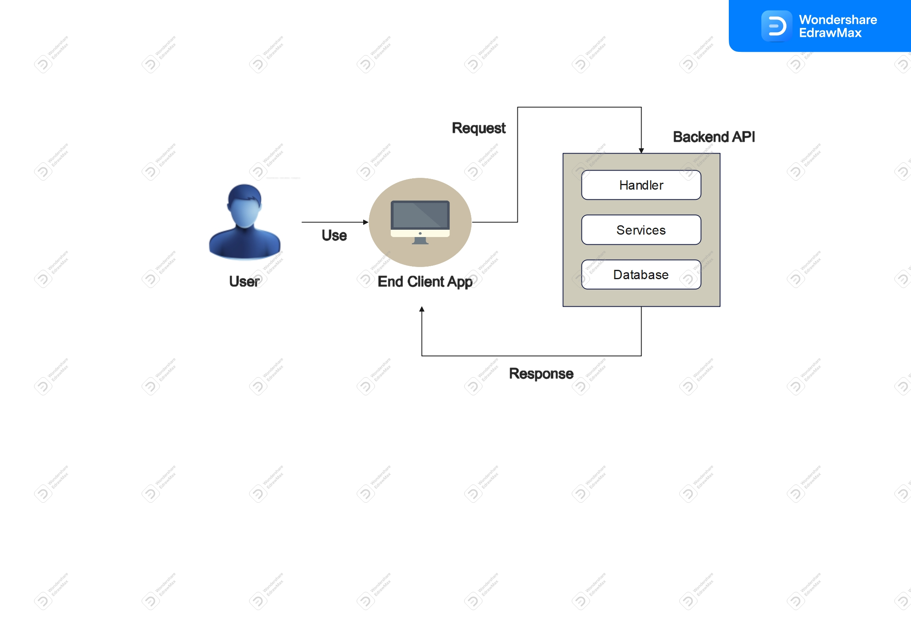

# MINI-PROJECT-NODEJS

# Simple Architecture Diagram



# ERD of the merchant service 


# API Contract

## POST /accounts/register

Add a Merchant Account to DB

- **URL Params**
  none
- **Data Params**
  ```
  {
  	"name": string,
  	"password": string,
  	"address": string,
  	"phone": string
  }
  ```
- **Header**
  Content-Type: application/json
- **Success Response:**
  - **Code:** 201
    `The user has been registered!`
- **Error Response:**
  - **Code:** 401
    Content: `This user is already in use!`

## POST /accounts/login

Login 

- **URL Params**
  none
- **Data Params**
  none
- **Header**
  Content-Type: application/json
  Authorization: Basic `<Basic Token>`
- **Success Response:**
  - **Code:** 200
    `{
              msg: "Logged in!",
              token,
              user: result[0],
            }`
- **Error Response:**
  - **Code:** 401
    Content: `Username or password is incorrect!`

## DELETE /accounts

Delete Account from Database

- **URL Params**
  none
- **Data Params**
  ```
  {
  	"name": string
  }
  ```
- **Header**
  Content-Type: application/json
  Cookie: access_token=`JWT token`
- **Success Response:**
  - **Code:** 200
    `User has been deleted successfully.`
- **Error Response:**
  - **Code:** 404
    Content: `Username is not found`

## GET /accounts

Show List Account 

- **URL Params**
  none
- **Data Params**
  none
- **Header**
  Content-Type: application/json
  Cookie: access_token=`JWT token`

## POST /accounts/get-user 

- **URL Params**
  none
- **Data Params**
  none
- **Header**
  Content-Type: application/json
  Authorization: Basic `Bearer`
- **Success Response:**
  - **Code:** 200
    `{
        error: false,
        data: results[0],
        message: "Fetch Successfully.",
      }`
- **Error Response:**
  - **Code:** 401
    Content: `Please provide the token`

## POST products/add

Add Product

- **URL Params**
  none
- **Data Params**
  ```
  {
  	"account_id": string,
  	"name_product": string,
  	"qty": string,
  	"price": string
  }
  ```
- **Header**
  none
- **Success Response:**
  - **Code:** 201
    `Product has been added`
- **Error Response:**
  - **Code:** 401
    Content: `Product ID already in used!`

## PUT /products

Update Product 

- **URL Params**
  none
- **Data Params**
  ```
  {
  	"name": string,
  	"qty": string,
  	"price": string
  }
  ```
- **Header**
  none
- **Success Response:**
  - **Code:** 201
    `Product has been update successfully`
- **Error Response:**
  - **Code:** 404
    Content: `Product ID is not found`

## GET /products

Show List Product 

- **URL Params**
  none
- **Data Params**
  none
- **Header**
  none


## DELETE products

Delete Products

- **URL Params**
  none
- **Data Params**
  ```
  {
  	"id": string
  }
  ```
- **Header**
 none
- **Success Response:**
  - **Code:** 200
    `Product has been deleted successfully.`
- **Error Response:**
  - **Code:** 404
    Content: `Product ID is not found`


